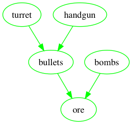

# resourceManager
**Author**: Yixuan Wei 
**FinishDate**: 2018/10/30 
This is a resource manager tool for programming portfolio of SMU Guildhall 2018, 
specific realization requirements could refer to "requirement.png".  
**GitHub**: https://github.com/yixuan-wei/resourceManager 
**Requirements**: C++17, built by g++ (GCC version 6.3.0), using the graphviz open-source tool for visualization of directed tool, only tested and supported for windows and mac OSX (if fail on mac, please check authority of folder graphviz and resourceManager.out) 
**Building**: sample building command:
> g++ -std=C++17 resourceManager.cpp Node.hpp

**visualization**: 
 
This is a sample graph for visualization, nodes are ovals with different colors (red for not usable, green for usable, black for not existed), dependences are directed lines between ovals with different colors (green line for existed dependence, red dotted line for not existed one)

### File Explanation:
- **resourceManager.cpp**: Responsible for main activity of resource manager, including commands and exact realization for each 
command
- **Node.hpp**: The Node class, including definition of all functions and parameters.
- **Node.hpp.gch**: temp file to boost building for g++ of file Node.hpp
- **ResourceManagerLog**: log file to store the manager status the last time it quits, read according to command
- **resource.txt**: stores the dependence relationship, read when launching the manager, 
would initialize the dependence relationship from start, unable to change relationship unless quit and refresh resource.txt
- **resourceManager.exe**: the successful version built from g++ for windows
- **resourceManager.out**: the successful version built from g++ for mac OSX
- **graph.png**: the graph visualization image
- **graphviz**: related dependencies of graphviz
  + **test.dot**: generated dot file from graph to be translated in to png by graphviz
  + **win**: graphviz dependence on windows platform
  + **apple**: graphviz dependence on mac osx platform
- **requirement.png**: exact requirements from the SMU Guildhall on resource manager

### Commands supported:
- **delete n**               :delete a node named n from the graph
- **insert node n**          :insert a node named n into the graph
- **insert dependence m n**  :insert a dependence that m depends on n into the graph
- **q**                      :quit the resource manager
- **load route_to_log**      :load the stored graph and dependences from route_to_log
- **print**                  :print the dependences for all resources, whether exists or not
- **visualize**              :visualize the graph
